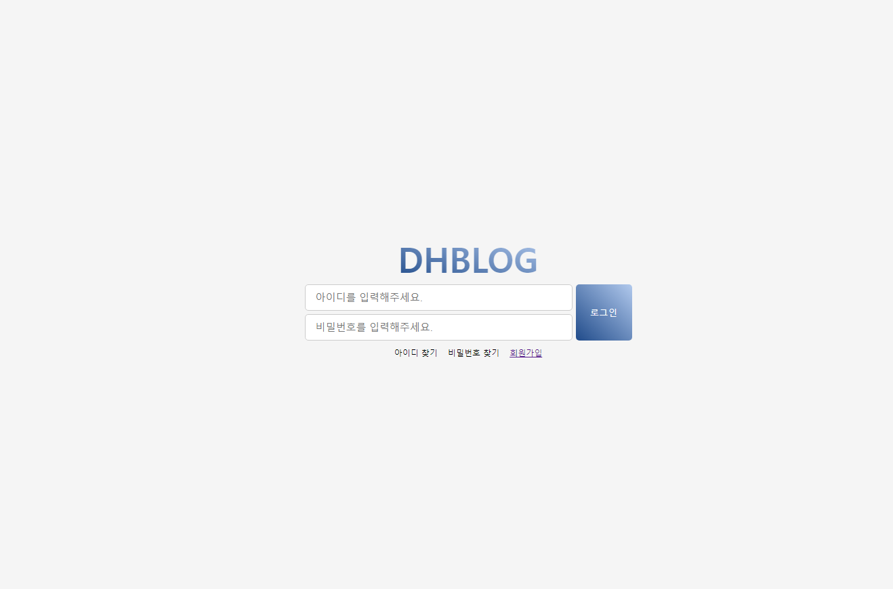
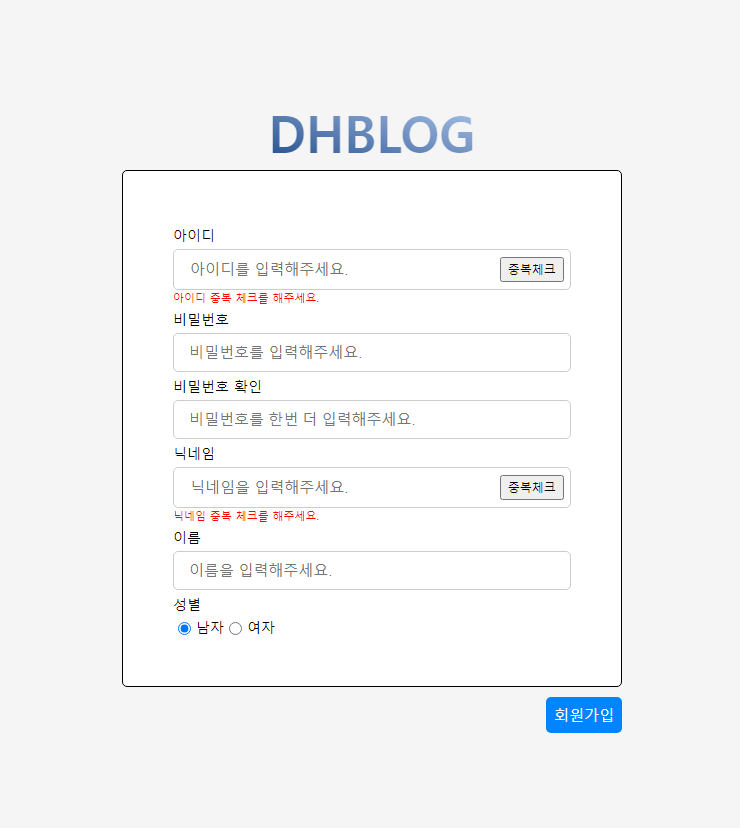
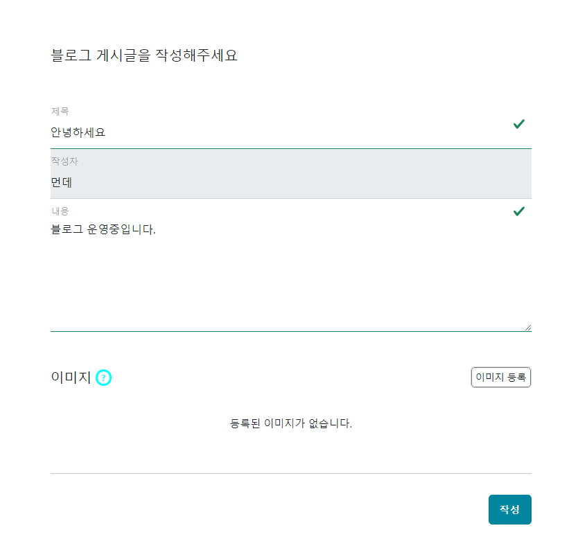
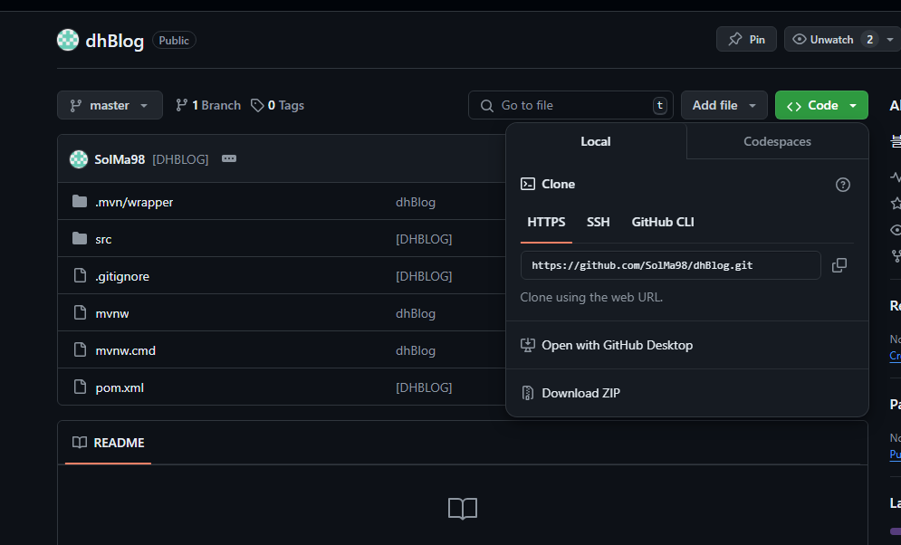

# DHBLOG
Spring Boot, MariaDB를 사용해서 개발한 BLOG

## 프로젝트 소개
글을 작성하고 글을 확인 할 수 있습니다. 

### 프로젝트 이미지
[로그인 페이지]

[회원 가입 페이지]

[블로그 글 리스트 페이지]

[블로그 글 작성/수정 페이지]

### 프로젝트 다운로드 방법
1.Git hub url 접속

URL : https://github.com/SolMa98/dhBlog

2.Clone Http 주소 복사

3.CMD에서 원하는 디렉터리에 위치

git clone {복사한 url}